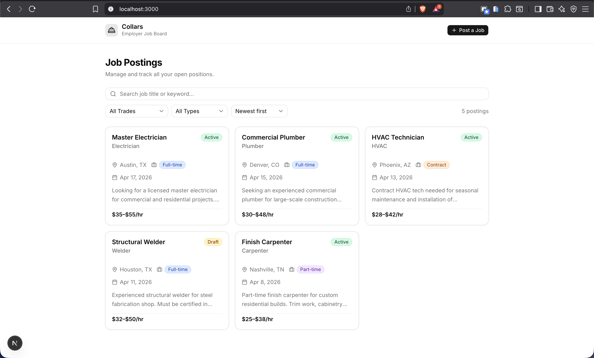
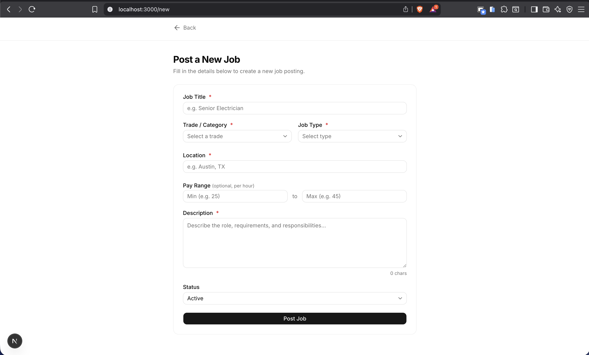
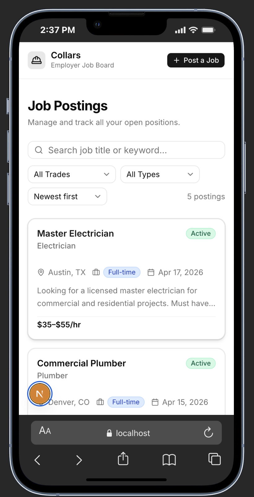
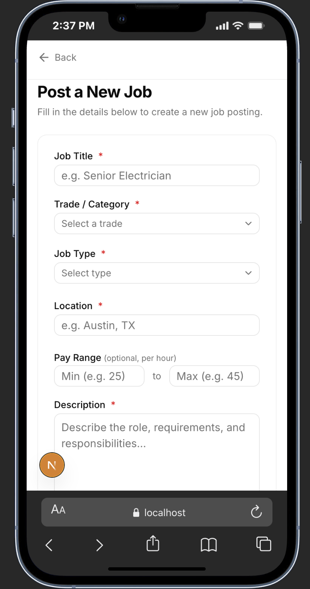
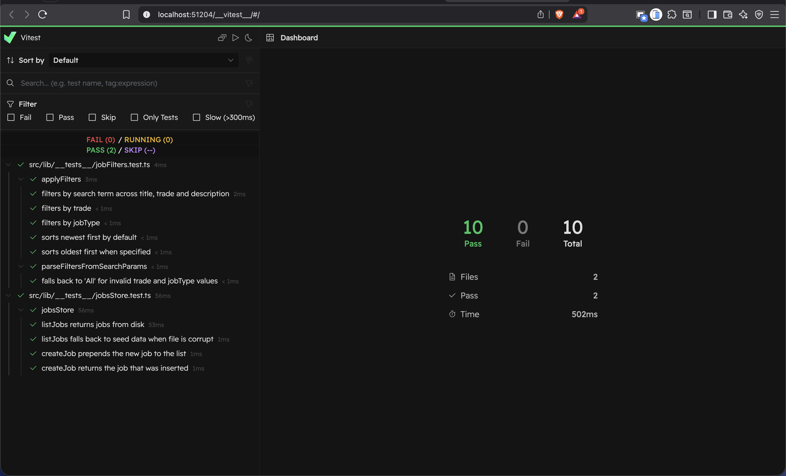

# Collars — Employer Job Board

A job board web app for skilled trades employers to post and manage job listings.

## Screenshots

| Job Board | New Job |
|---|---|
|  |  |

| Mobile — Board | Mobile — Form |
|---|---|
|  |  |



## Setup & Run

**Requirements:** [nvm](https://github.com/nvm-sh/nvm), pnpm

**1. Clone the repository**

```bash
git clone https://github.com/ETBGM03/collars-job-board.git
cd collars-job-board
```

**2. Install and use the correct Node version**

```bash
nvm install   # reads .nvmrc — installs v22.22.2 if not present
nvm use       # switches to v22.22.2
```

**3. Install dependencies**

```bash
pnpm install
```

**4. Start the development server**

```bash
pnpm dev
```

Open [http://localhost:3000](http://localhost:3000).

**5. Run the tests**

```bash
pnpm test        # run all tests once
pnpm test:ui     # open Vitest UI in the browser
```

No environment variables or external services required — data is persisted to `src/mock/initialSeeder.json`.

## Features

- Browse job postings with live search, trade/type filters, and sort order — all synced to the URL
- Post new jobs via a validated form
- Responsive layout across mobile and desktop

## Architectural Decisions

### Server Components as the default

`app/page.tsx` is a Server Component that fetches jobs and applies filters on the server before sending HTML. Filtering server-side means no loading states or client-side data fetching on the board page.

### Server Action for mutations

`app/actions/jobs.ts` handles job creation via a Server Action (`"use server"`). After inserting, it calls `revalidatePath("/")` so the board is re-fetched with fresh data on the next visit — no manual cache invalidation needed.

### URL-driven filters

Filters live in the URL query string (`?q=&trade=&type=&sort=`). This makes the board shareable and browser-navigable. `JobFiltersUrlBar` owns the URL sync logic; `JobFiltersBar` is a pure presentational component that can be reused independently.

### Debounced search without cascading renders

The search input uses a `useDebounce` hook with a `useRef` for the delay value. The URL is only updated after the user stops typing, reducing router transitions. State sync from URL → input is done during render (not in a `useEffect`) to avoid cascading render issues flagged by the React Compiler.

### Form validation with react-hook-form

`JobForm` uses `react-hook-form` with declarative validation rules in `register()` and `Controller` for Radix `Select` fields. Validation logic is co-located with each field rather than in a separate manual `validate()` function.

### Component separation

| Layer                    | Location                              |
| ------------------------ | ------------------------------------- |
| Types                    | `src/types/job.ts`                    |
| Constants                | `src/constants/jobBoard.constants.ts` |
| Data store               | `src/lib/jobsStore.ts`                |
| Filters logic            | `src/lib/jobFilters.ts`               |
| Reusable form primitives | `src/components/form/`                |
| Page-level components    | `src/components/`                     |

## What I'd Improve Given More Time

- **Persistent storage** — replace the JSON file store with a real database (e.g. SQLite via Prisma, or hosted Postgres). The current file-based store doesn't scale and breaks under concurrent writes.
- **Job detail page** — clicking a card would open a full job page at `/jobs/[id]`.
- **Edit & delete** — employers should be able to manage existing postings.
- **Optimistic UI** — wrap job creation in `useOptimistic` so the new card appears immediately on the board before the server round-trip completes.
- **Auth** — gate the "Post a Job" flow behind an employer login so listings are scoped per user.
